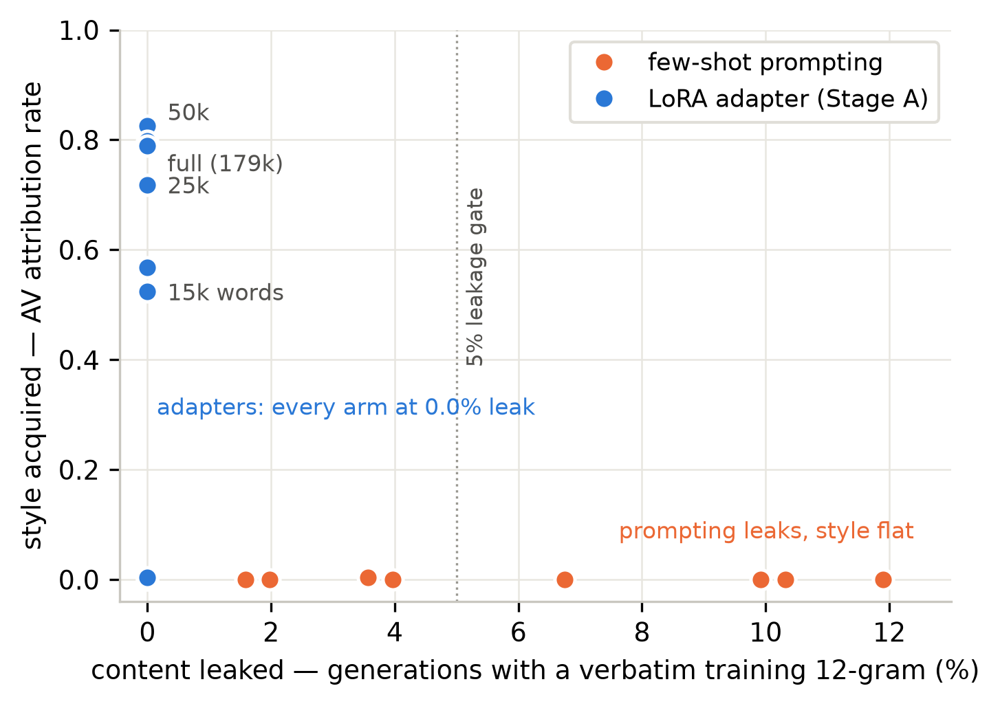
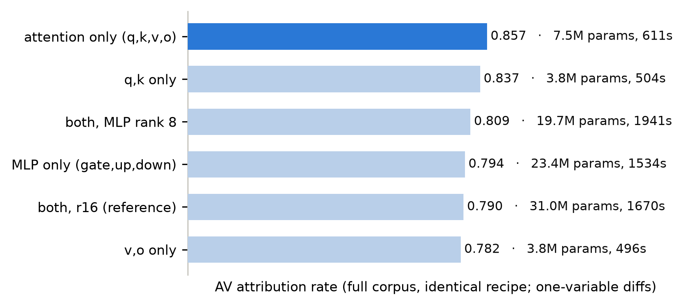
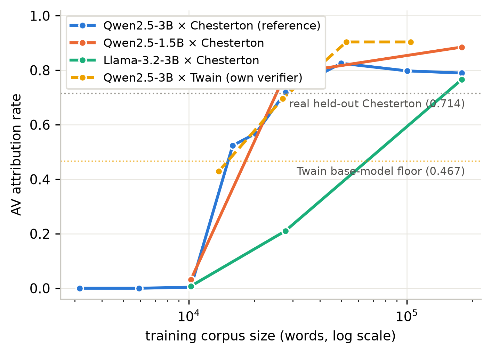

# ductus

**Can a language model learn an author's voice without stealing their words?**

That question started this project. I write a lot, and I wanted a model that writes like *me* —
my rhythm, my sentence shapes, my idiom — without it ever regurgitating my actual sentences or
the private facts inside them. Most people assume those two things come as a package: teach a
model your voice and you've necessarily taught it your content. This repo is a controlled study
of whether that assumption is true. It isn't.

`ductus` trains a small, deletable LoRA adapter on a 3B open-weight model from one author's
prose, and measures two things against each other on every run: **style acquired** (does a
frozen authorship verifier attribute the output to the author?) and **content leaked**
(verbatim n-grams, entity emission, paraphrase-level echo). Everything else in the repo exists
to make that one comparison trustworthy.

## Three research questions

1. **Corpus size (RQ1):** How many words of someone's writing does it take before an adapter
   picks up their voice — and does leakage grow alongside it?
2. **Adapter placement (RQ2):** Where in the transformer does a voice live? If you only adapt
   attention, or only the MLPs, what do you get?
3. **Training stage (RQ3):** Does a second stage of on-policy DPO — preferring the author's
   real sentences over the model's own attempts — push the style further, and does it pay for
   that by memorizing the preference targets?

## Key findings

**1. A voice switches on like a phase transition, not a dial.** Below ~10k training words the
adapter sounds nothing like the author (attribution ≈ 0). Between 10k and 15k words it jumps to
0.52, and by 25–50k it saturates at 0.79–0.90 — *above* the 0.71 rate at which the author's own
held-out prose is attributed to him. The step counts across arms suggest the binding variable
is optimization steps, not words.

**2. The privacy intuition is exactly backwards.** Few-shot prompting — the "safe" method that
trains nothing — copied whole training passages verbatim (up to 11.9% of generations) while
never acquiring the style. The trained adapter acquired the style and copied *nothing*: zero
verbatim 12-grams across every adapter run in the study, at every corpus size, every placement,
every checkpoint.

| method | style acquired (AV) | verbatim leakage |
|---|---|---|
| few-shot prompting | ≈ 0.00 | up to **11.9%** (5 of 9 arms fail the 5% gate) |
| LoRA adapter | **0.77 – 0.90** at saturation | **0.0%**, everywhere |



**3. The voice lives in attention.** Adapting attention only beats adapting everything: better
attribution (0.857 vs 0.790), a quarter of the parameters, a third of the wall-clock, and
*improved* general fluency. The q,k matrices — where attention *looks* — carry most of it; the
v,o matrices the memorization literature worries about contribute the least style. Training a
voice takes about **10 minutes on one GPU**.



**4. It replicates.** Same cliff-then-plateau shape and same zero leakage across three base
models (Qwen-3B, Qwen-1.5B, Llama-3.2-3B) and a second author in a different register — Mark
Twain's conversational memoir prose, where the adapter climbs from a 0.47 base-model floor to
0.904, on the author the base model is *least* familiar with. Two independently trained
verifiers rank all runs the same way (Spearman 0.93). The cliff's *location* moves with the
model; the shape doesn't.



**5. One honest caveat, found by our own diagnostic.** Zero *verbatim* copying is a property of
the training recipe itself — it survives even when we train on unscrubbed text. Entity hygiene
is not: unscrubbed training doubles the rate at which the adapter emits names from the corpus.
"Style without content" is a property of the pipeline *and* the adapter together, and the
pipeline's PII scrubbing is load-bearing.

Full results with confidence labels, the DPO interaction (it helps the full adapter, +0.055,
and mildly hurts the attention-only one — so the recommended recipe is attention-only SFT,
full stop), and threats to validity: **[`docs/STATUS.md`](docs/STATUS.md)**.

## Method in one paragraph

Take one author's documents (dev corpus: G.K. Chesterton, public domain, ~256k words). Chunk
them into response-sized passages, scrub names and places to typed placeholders, and have a
*separate* hosted model write the question each passage answers — instruction backtranslation,
so every training target is a **real sentence the author wrote**, never model output. Fine-tune
a LoRA adapter on those (question → passage) pairs (Stage A), optionally followed by on-policy
DPO where `chosen` is always real text (Stage B). Every run generates 252 blind-set responses
and is scored by a frozen style verifier (fit once per corpus, document-grouped, deduped,
held-out AUC 0.896) plus three leakage channels, a fluency budget, and a pretraining-
contamination probe. One run = one `report.json`; tables and figures only ever come from those
records.

## Reproduce it

```bash
python -m venv .venv && source .venv/bin/activate
pip install -e ".[cpu]"

pytest -q                             # full CPU test suite, < 3 s
make demo                             # end-to-end pipeline on the bundled fixture author
python scripts/assemble_results.py    # rebuild every table + figure from committed run records
python scripts/make_figures.py        # rebuild the publication figures
```

The committed `runs/**/report.json` records are the ground truth — nothing in the tables above
is hand-typed, and `assemble_results.py` regenerates them byte-for-byte. To re-run the actual
training matrix you need one 24 GB+ GPU (`pip install -e ".[gpu]"`); the entire evidence base —
every arm, ablation, seed, model, and author — cost **about 6 GPU-hours on a single NVIDIA
L40S**. Drivers and the run order are in [`docs/RUN_MATRIX.md`](docs/RUN_MATRIX.md); the
per-phase chronology is at the bottom of
[`runs/results/tables.md`](runs/results/tables.md).

## The rules that keep it honest

- **Real text is the target in every training signal.** Stage-A targets and Stage-B `chosen`
  are always passages the author wrote. The question generator is a separate API model, never
  the trainee. This is what prevents the self-distillation collapse loop.
- **The ruler never moves.** One verifier per corpus, fit once, frozen across every arm. If the
  assembler ever prints two AUCs, the comparison is invalid by construction.
- **Splits are by document, never by chunk** — sibling chunks share topic and phrasing, and
  chunk-level splits quietly inflate every metric.
- **A run passes only if all gates pass** (leakage ≤ 5%, fluency within budget). An adapter
  with a great style score and a failed gate is a failed run.

## Layout

```
src/wlm/           ingest → chunk → scrub → backtranslate → train → generate → eval
configs/           one YAML per arm; every ablation is a one-line diff
scripts/           numbered phase drivers, resumable matrix runner, results assembler
runs/              committed per-run records (report.json, gen.jsonl) + assembled results
authors/twain/     the replication author — a complete parallel tree, same layout
docs/              PLAN (design) · STATUS (living results) · RUN_MATRIX (how to run it all)
```

## Privacy posture

The dev corpus is public-domain fixture text (see `data/README.md`); real writing never ships —
`make check-data` guards every commit. Scrubbing writes an audit log. The only personal
artifact this produces is the adapter itself: a few tens of MB, and deleting it deletes the
voice.
